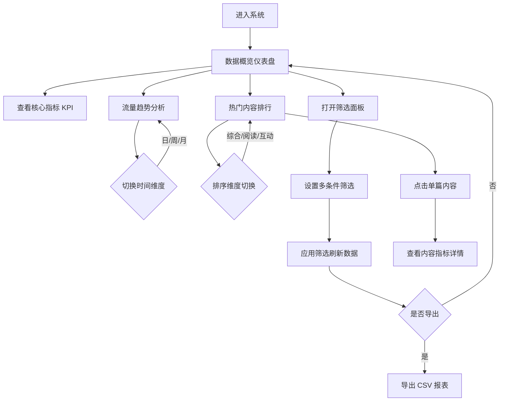

## 1. 产品概述

内容数据聚合与可视化运营分析平台，为内容运营人员提供图文数据的全链路分析能力。整合单篇图文的阅读、点赞、转发、评论、收藏数据，通过多维度统计和图表展示，帮助运营团队核算内容整体表现并优化内容策略。

## 2. 核心功能

### 2.1 用户角色

| 角色 | 注册方式 | 核心权限 |
|------|----------|----------|
| 运营管理员 | 系统内置 | 查看所有数据、导出报表、配置筛选条件 |
| 内容运营 | 系统内置 | 查看数据报表、筛选分析、导出数据 |

### 2.2 功能模块

1. **数据概览仪表盘**: 核心指标卡片、整体运营表现摘要
2. **流量趋势分析**: 按时间维度的阅读/互动趋势折线图
3. **热门内容排行**: 按各维度指标的内容排行榜
4. **多维度统计分析**: 按发布日期、内容分类的交叉统计
5. **数据筛选与导出**: 多条件组合筛选、CSV/Excel 数据导出
6. **单篇内容详情**: 单篇图文完整指标数据展示

### 2.3 页面详情

| 页面名称 | 模块名称 | 功能描述 |
|----------|----------|----------|
| 数据概览 | 核心指标卡片 | 展示总阅读量、互动率、粉丝引流数、阅读完成率等 KPI |
| 数据概览 | 整体运营评估 | 内容整体运营表现评分与趋势指示 |
| 流量趋势 | 时间趋势图 | 按日/周/月展示阅读、点赞、转发等指标走势 |
| 流量趋势 | 分类占比图 | 内容分类的流量占比饼图/环形图 |
| 内容排行 | 热门内容列表 | 按综合/阅读/互动排序的热门内容 TOP 榜 |
| 内容排行 | 分类维度分析 | 各内容分类的数据对比柱状图 |
| 数据筛选 | 筛选面板 | 按日期范围、内容分类、指标阈值进行多条件筛选 |
| 数据导出 | 导出功能 | 导出筛选后的数据为 CSV 格式 |
| 内容详情 | 指标详情页 | 单篇内容的所有指标明细数据展示 |

## 3. 核心流程

运营人员登录系统后，默认进入数据概览页面查看核心指标。通过时间维度切换查看不同周期的流量趋势，使用筛选面板按日期、分类等条件过滤数据，查看热门内容排行分析内容表现，需要时导出数据报表做进一步分析。

## 4. 用户界面设计

### 4.1 设计风格

- 主色: 深靛蓝 `#1E3A5F` 代表专业数据分析
- 辅色: 活力橙 `#F59E0B` 用于强调数据亮点
- 中性色: 冷灰系列 `#F8FAFC #E2E8F0 #64748B #1E293B`
- 按钮风格: 微圆角 (6px)，悬浮态带柔和阴影提升
- 字体: 中文使用 "PingFang SC" / "Microsoft YaHei"，数字使用 "JetBrains Mono" 等宽字体
- 布局风格: 左侧导航 + 顶部标题栏 + 卡片式内容区
- 图标风格: Lucide 线性图标，统一 stroke-width

### 4.2 页面设计概览

| 页面名称 | 模块名称 | UI 元素 |
|----------|----------|----------|
| 数据概览 | 指标卡片 | 渐变背景、大字号数字、趋势箭头指示、图标装饰 |
| 数据概览 | 运营评估 | 半环形进度图、评分等级标签 |
| 流量趋势 | 趋势图表 | 多色折线图、区域渐变填充、悬浮 tooltip |
| 流量趋势 | 分类占比 | 环形图、图例联动高亮 |
| 内容排行 | 排行列表 | 排序序号徽章、进度条对比、分类标签 |
| 数据筛选 | 筛选面板 | 日期范围选择器、分类多选下拉、数值滑块 |
| 内容详情 | 详情面板 | 分块指标展示、迷你趋势图、数据对比 |

### 4.3 响应式

桌面端优先设计（1440px 基准），自适应适配 1280px-1920px 屏幕。内容区采用 CSS Grid 布局，指标卡片支持自动换行。图表容器固定最小高度保证可读性。
