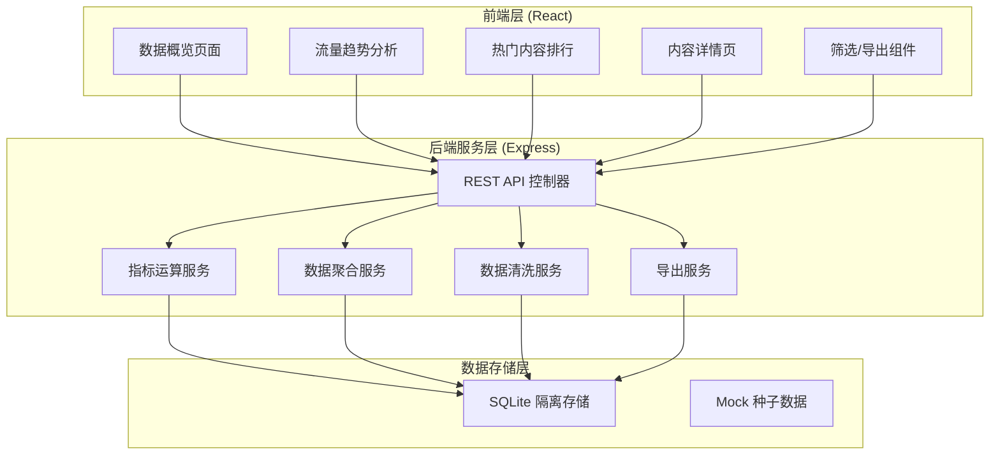
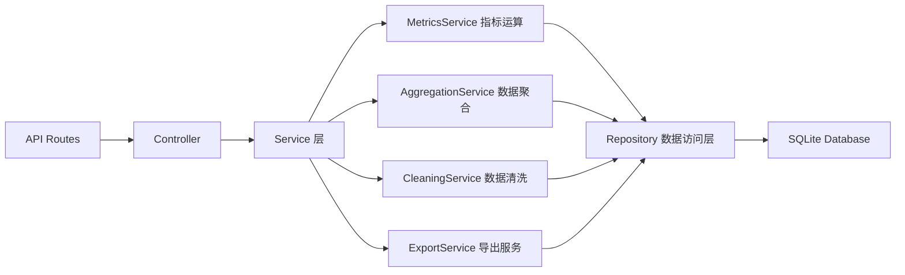
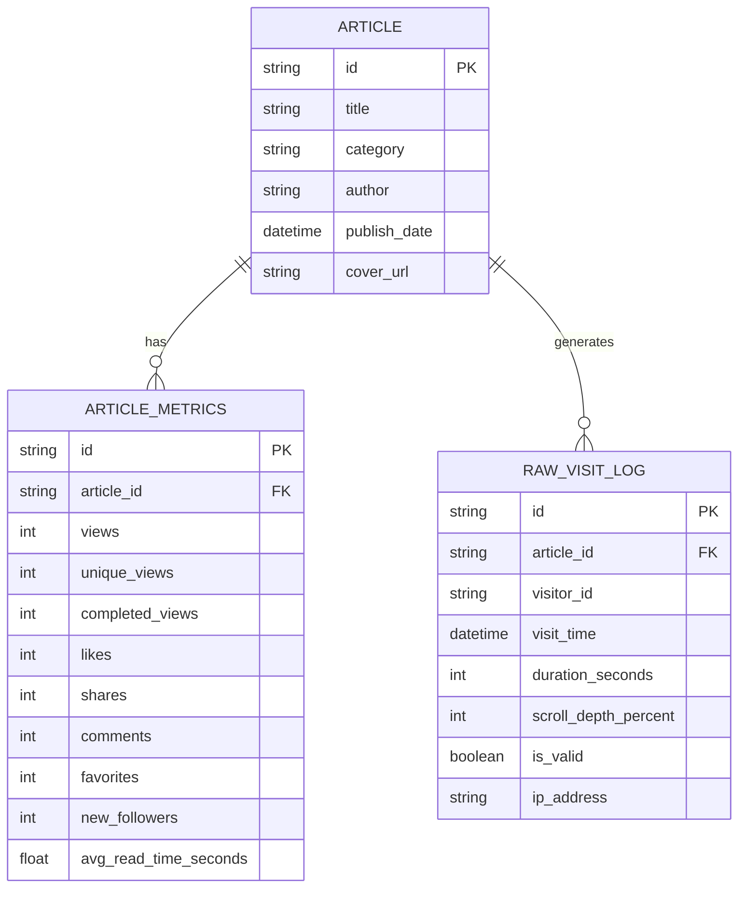

## 1. 架构设计



## 2. 技术说明

- 前端: React@18 + TypeScript + TailwindCSS@3 + Vite
- 图表库: Recharts (React 原生图表库，轻量高性能)
- 状态管理: Zustand
- 路由: react-router-dom
- 后端: Express@4 + TypeScript (ESM)
- 数据库: SQLite (better-sqlite3) - 全量数据隔离存储
- 图标: lucide-react
- 服务端口: 8726

## 3. 路由定义

| 路由 | 用途 |
|------|------|
| / | 数据概览仪表盘 |
| /trends | 流量趋势分析 |
| /ranking | 热门内容排行 |
| /content/:id | 单篇内容详情 |

## 4. API 定义

### 4.1 类型定义

```typescript
interface Article {
  id: string;
  title: string;
  category: string;
  publishDate: string;
  author: string;
}

interface ArticleMetrics {
  articleId: string;
  views: number;
  uniqueViews: number;
  completedViews: number;
  likes: number;
  shares: number;
  comments: number;
  favorites: number;
  newFollowers: number;
  avgReadTime: number;
}

interface AggregatedStats {
  totalViews: number;
  totalUniqueViews: number;
  totalLikes: number;
  totalShares: number;
  totalComments: number;
  totalFavorites: number;
  totalNewFollowers: number;
  completionRate: number;
  engagementRate: number;
}

interface TrendPoint {
  date: string;
  views: number;
  likes: number;
  shares: number;
  comments: number;
}

interface FilterParams {
  startDate?: string;
  endDate?: string;
  categories?: string[];
  minViews?: number;
  sortBy?: 'views' | 'likes' | 'engagement' | 'date';
}
```

### 4.2 接口列表

| 方法 | 路径 | 描述 |
|------|------|------|
| GET | /api/stats/overview | 获取概览核心指标 |
| GET | /api/stats/trends | 获取趋势数据 (query: period=day/week/month) |
| GET | /api/articles | 获取文章列表 (支持筛选 query params) |
| GET | /api/articles/:id | 获取单篇文章详情及指标 |
| GET | /api/articles/ranking | 获取热门排行 |
| GET | /api/categories | 获取所有内容分类及统计 |
| GET | /api/export/csv | 导出筛选数据为 CSV |

## 5. 服务端架构



## 6. 数据模型

### 6.1 ER 图



### 6.2 核心指标计算逻辑

1. **阅读完成率** = completed_views / unique_views * 100%
2. **互动率** = (likes + shares + comments + favorites) / unique_views * 100%
3. **粉丝引流数** = new_followers 汇总
4. **无效访问清洗规则**:
   - 访问时长 < 3 秒
   - 滚动深度 < 5%
   - 同一访客 1 小时内重复访问 (按 visitor_id 去重)

### 6.3 DDL 语句

```sql
CREATE TABLE IF NOT EXISTS articles (
    id TEXT PRIMARY KEY,
    title TEXT NOT NULL,
    category TEXT NOT NULL,
    author TEXT NOT NULL,
    publish_date DATETIME NOT NULL,
    cover_url TEXT
);

CREATE TABLE IF NOT EXISTS article_metrics (
    id TEXT PRIMARY KEY,
    article_id TEXT NOT NULL,
    views INTEGER DEFAULT 0,
    unique_views INTEGER DEFAULT 0,
    completed_views INTEGER DEFAULT 0,
    likes INTEGER DEFAULT 0,
    shares INTEGER DEFAULT 0,
    comments INTEGER DEFAULT 0,
    favorites INTEGER DEFAULT 0,
    new_followers INTEGER DEFAULT 0,
    avg_read_time_seconds REAL DEFAULT 0,
    FOREIGN KEY (article_id) REFERENCES articles(id)
);

CREATE TABLE IF NOT EXISTS raw_visit_logs (
    id TEXT PRIMARY KEY,
    article_id TEXT NOT NULL,
    visitor_id TEXT NOT NULL,
    visit_time DATETIME NOT NULL,
    duration_seconds INTEGER DEFAULT 0,
    scroll_depth_percent INTEGER DEFAULT 0,
    is_valid BOOLEAN DEFAULT 1,
    ip_address TEXT,
    FOREIGN KEY (article_id) REFERENCES articles(id)
);

CREATE INDEX IF NOT EXISTS idx_article_metrics_article_id ON article_metrics(article_id);
CREATE INDEX IF NOT EXISTS idx_visits_article_time ON raw_visit_logs(article_id, visit_time);
CREATE INDEX IF NOT EXISTS idx_articles_publish_date ON articles(publish_date);
CREATE INDEX IF NOT EXISTS idx_articles_category ON articles(category);
```
